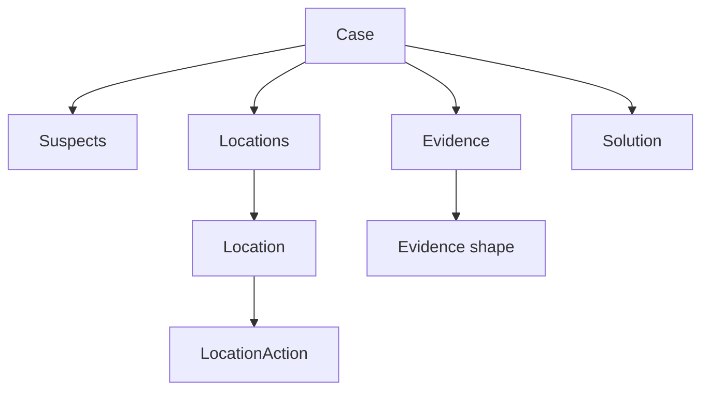
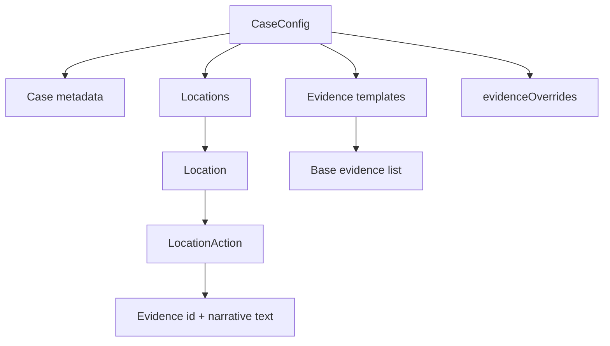
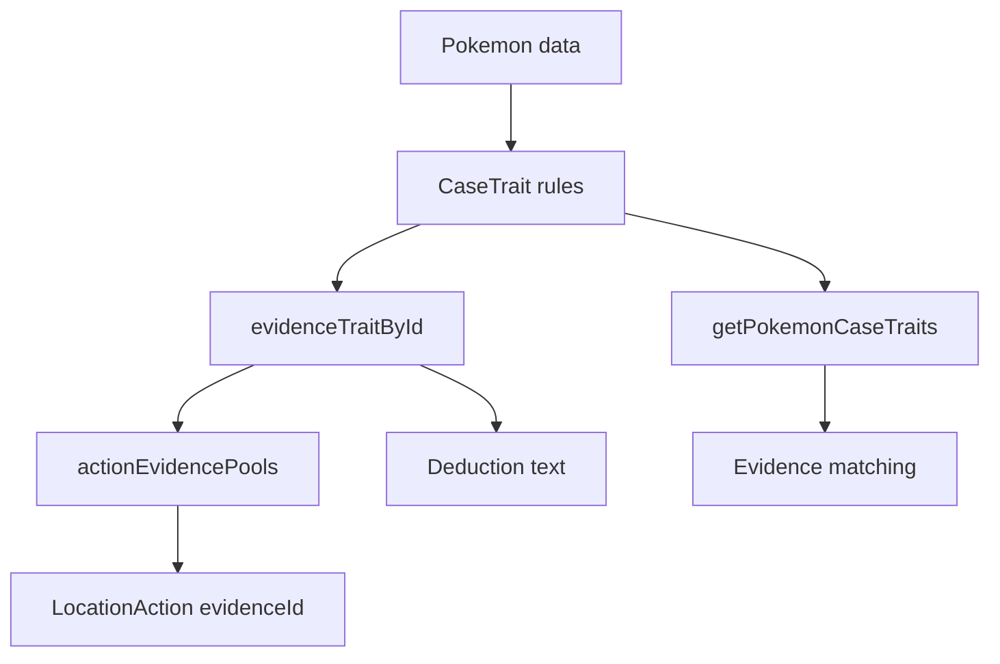

# React + TypeScript + Vite

This template provides a minimal setup to get React working in Vite with HMR and some Oxlint rules.

## Local Development

Run the API and frontend in separate terminals:

```sh
npm run dev:api
npm run dev
```

Local development is wired for the test environment. Copy `.env.example` to `.env.local` and fill the test Cognito values from Terraform outputs before starting the API.

The frontend expects the API at `http://localhost:3001` by default. If that port is already in use, start the API on another port and point Vite at it:

```sh
PORT=3002 npm run dev:api
VITE_API_TARGET=http://localhost:3002 npm run dev
```

The frontend uses `localhost:5173` for local auth redirects. If that port is already in use, stop the existing Vite process rather than letting the app move to another port.

The local API loads `.env.local` and verifies Cognito tokens against `USER_POOL_ID`. Override it for another environment with:

```sh
USER_POOL_ID=us-east-1_example npm run dev:api
```

## Environments

Production is not deployed automatically. Pushes to `main` deploy to the GitHub `test` environment only. Deploy production manually from the `Deploy` workflow with `environment=prod`.

The deploy workflow uses repository secrets; GitHub Environments are not required. Test deploys prefer `TEST_AWS_ACCESS_KEY_ID`, `TEST_AWS_SECRET_ACCESS_KEY`, `TEST_AWS_REGION`, `TEST_S3_BUCKET_NAME`, `TEST_CLOUDFRONT_DISTRIBUTION_ID`, and `TEST_VITE_COGNITO_CLIENT_ID`, then fall back to the unprefixed production-era secret names. Test Cognito defaults to `pokemon-detective-test` unless `TEST_COGNITO_DOMAIN` is set. Production deploys prefer `PROD_...` secrets, then fall back to unprefixed secrets.

Use separate Terraform variables per environment. Start test from `terraform/test.tfvars.example`; it configures `https://test.pokemysterygame.com`, creates DNS records in the parent `pokemysterygame.com` hosted zone, and uses separate DynamoDB tables: `CaseDataTest`, `PlayerProgressTest`, and `PokedexTest`.

## Case Hierarchy

### `src/game/caseModel.ts`



### `src/game/cases/`



### `src/game/caseGeneration.ts`



This is the authored content shape to keep in mind when adding a new case.

Currently, two official plugins are available:

- [@vitejs/plugin-react](https://github.com/vitejs/vite-plugin-react/blob/main/packages/plugin-react) uses [Oxc](https://oxc.rs)
- [@vitejs/plugin-react-swc](https://github.com/vitejs/vite-plugin-react/blob/main/packages/plugin-react-swc) uses [SWC](https://swc.rs/)

## React Compiler

The React Compiler is not enabled on this template because of its impact on dev & build performances. To add it, see [this documentation](https://react.dev/learn/react-compiler/installation).

## Expanding the Oxlint configuration

If you are developing a production application, we recommend enabling type-aware lint rules by installing `oxlint-tsgolint` and editing `.oxlintrc.json`:

```json
{
  "$schema": "./node_modules/oxlint/configuration_schema.json",
  "plugins": ["react", "typescript", "oxc"],
  "options": {
    "typeAware": true
  },
  "rules": {
    "react/rules-of-hooks": "error",
    "react/only-export-components": ["warn", { "allowConstantExport": true }]
  }
}
```

See the [Oxlint rules documentation](https://oxc.rs/docs/guide/usage/linter/rules) for the full list of rules and categories.
